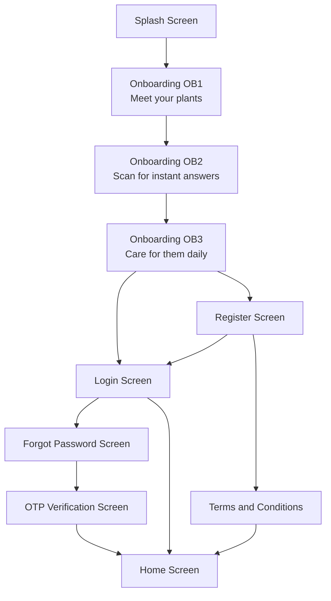

# LeafCheck-AI: Splash to Home Screen Implementation Plan (Frontend Only)

## Overview

This plan covers building the **frontend UI and basic navigation** for the authentication flow from Splash Screen through Home Screen, following the provided UI/UX designs. **No auth hooks, no backend integration** -- just static screens with navigation between them.

---

## Flow Diagram



---

## Screens to Build (8 Total)

| #   | Screen                      | File Path                  | Priority |
| --- | --------------------------- | -------------------------- | -------- |
| 1   | Splash Screen               | `app/splash.tsx`           | P0       |
| 2   | Onboarding Screen           | `app/onboarding.tsx`       | P0       |
| 3   | Login Screen                | `app/login.tsx`            | P0       |
| 4   | Register Screen             | `app/register.tsx`         | P0       |
| 5   | Forgot Password Screen      | `app/forgot-password.tsx`  | P1       |
| 6   | OTP Verification Screen     | `app/otp-verification.tsx` | P1       |
| 7   | Terms and Conditions Screen | `app/terms.tsx`            | P1       |
| 8   | Home Screen                 | `app/(tabs)/index.tsx`     | P0       |

---

## Phase 1: Root Layout Updates

### Task 1.1: Update Root Layout for Navigation

**File:** [`app/_layout.tsx`](app/_layout.tsx)

**Changes:**

- Add Splash screen as initial route (auto-navigates after 2s)
- Register all auth screens in the Stack navigator
- Keep existing tabs layout for Home screen
- Remove or deprecate the existing `modal` route temporarily

**Routing Structure:**

```
Root Stack Navigator
├── Splash (initial, auto-navigates after 2s)
├── Onboarding
├── Login
├── Register
├── ForgotPassword
├── OTPVerification
├── Terms
└── (tabs) - Main app with Home screen
```

**No auth context needed.** Navigation is linear/hardcoded:

- Splash → always goes to Onboarding
- Onboarding OB3 → goes to Login
- Login/Register → hardcoded navigation to next screen
- No state management for auth

---

## Phase 2: Splash Screen

### Task 2.1: Create Splash Screen

**File:** `app/splash.tsx`

**Design Specs:**

- Full-screen centered layout
- Leaf Check logo (magnifying glass with leaf icon)
- "LEAF CHECK" text below the logo
- White background
- Auto-navigate after 2 seconds to Onboarding

**Components Needed:**

- Custom SVG/logo component (`components/leaf-check-logo.tsx`)
- Use `expo-splash-screen` for splash behavior
- Use `useEffect` with `setTimeout` for auto-navigation

---

## Phase 3: Onboarding Screens

### Task 3.1: Create Onboarding Screen

**File:** `app/onboarding.tsx`

**Design Specs:**

- Horizontal swipeable carousel with 3 slides
- Dot indicators at bottom showing current position
- Navigation arrows (back on OB2/OB3)
- Different CTA text per slide:
  - OB1: "GET STARTED" button
  - OB2: "NEXT" button
  - OB3: "LET'S GO" button

**Slide Content:**

| Slide | Icon/Visual       | Title                    | Description                                            | Background Color       |
| ----- | ----------------- | ------------------------ | ------------------------------------------------------ | ---------------------- |
| OB1   | Leaf Check logo   | Meet your plants         | Scan any leaf to instantly identify the species        | White                  |
| OB2   | Camera icon       | Scan for instant answers | Life IoT sensors read soil moisture pH and temperature | Light Green (#C8E6C9)  |
| OB3   | Location pin icon | Care for them daily      | Track alerts and archive plants you've set up          | Light Yellow (#FFF9C4) |

**Components Needed:**

- `components/onboarding-slider.tsx` - Horizontal carousel with pagination
- `components/onboarding-dot-indicator.tsx` - Dot pagination component
- Reuse `LeafCheckLogo` from splash screen

**Navigation:**

- "GET STARTED" / "NEXT" / "LET'S GO" → navigate to next slide or Login

---

## Phase 4: Authentication Screens (UI Only)

### Task 4.1: Create Login Screen

**File:** `app/login.tsx`

**Design Specs:**

- Leaf Check logo at top (centered)
- "Log in" title below logo
- **Email input field** with label
- Password input field with visibility toggle icon
- "Forgot Password?" link below password
- "Log in" button (full width, green accent)
- "No account? Sign up" text at bottom

**Components Needed:**

- `components/custom-text-input.tsx` - Reusable styled input
- `components/auth-button.tsx` - Styled button component
- `components/password-toggle.tsx` - Eye icon toggle for password visibility

**Navigation Links (hardcoded):**

- "Forgot Password?" → `/forgot-password`
- "Sign up" → `/register`

### Task 4.2: Create Register Screen

**File:** `app/register.tsx`

**Design Specs:**

- Leaf Check logo at top (centered)
- "Sign up" title below logo
- Fields (in order):
  1. Email input with label
  2. First Name input with label
  3. Last Name input with label
  4. Password input (with visibility toggle)
  5. Confirm Password input (with visibility toggle)
- "Register" button (full width, green accent)
- "Already have an account? Log in" text at bottom

**Components Needed:**

- Reuse `CustomTextInput` from login screen
- Reuse `AuthButton` from login screen
- Reuse `PasswordToggle` from login screen

**Navigation Links (hardcoded):**

- "Log in" → `/login`

### Task 4.3: Create Forgot Password Screen

**File:** `app/forgot-password.tsx`

**Design Specs:**

- Lock icon placeholder (brown background square)
- "Forgot Password" title
- "Enter Email" input field with label
- "Send OTP" button
- Back arrow to return to Login

**Navigation Links (hardcoded):**

- After tapping "Send OTP" → `/otp-verification` with email pre-filled via params

### Task 4.4: Create OTP Verification Screen

**File:** `app/otp-verification.tsx`

**Design Specs:**

- Lock icon (same as Forgot Password)
- "OTP Verification" title
- "We sent a code to [email]" subtitle (from params)
- 6-digit OTP input (individual boxes or single input with auto-tab)
- "Verify" button
- "Resend Code" link with countdown timer (60 seconds)
- Back arrow to return to Forgot Password

**Features:**

- Auto-focus first OTP box
- Auto-advance to next box on input
- Countdown timer for resend (60 seconds)
- Validate OTP length before verify

**Navigation Links (hardcoded):**

- After tapping "Verify" → `/` (Home screen)
- "Resend Code" → reset timer (no actual resend)
- Back arrow → `/forgot-password`

### Task 4.5: Create Terms and Conditions Screen

**File:** `app/terms.tsx`

**Design Specs:**

- Back arrow to return to Register
- "Terms and Conditions" title
- Scrollable terms content area (placeholder text)
- "Accept" button
- "Deny" button

**Navigation Links (hardcoded):**

- "Accept" → `/` (Home screen)
- "Deny" → `/register` (back to register)

---

## Phase 5: Home Screen

### Task 5.1: Redesign Home Screen

**File:** [`app/(tabs)/index.tsx`](<app/(tabs)/index.tsx>)

**Design Specs:**
Based on the "HomePage with AI Estimates" mockup:

**Header Section:**

- "Hello, User & Good Morning!" greeting (dynamic based on time)
- Profile icon (top right corner)
- Date display below greeting

**Plant Overview Card:**

- Plant image placeholder/banner area
- Status badges overlay (Healthy/Warning/Critical)
- Plant name and species info

**AI Estimates Section:**

- 4 metric cards in grid layout:
  1. **Soil Moisture** - Value + progress bar/gauge
  2. **Soil pH** - Value + status indicator
  3. **Temperature** - Value with unit (C)
  4. **Recent Alerts** - Count badge

**Bottom Navigation Bar:**

- Home icon (active)
- Scan/Camera icon
- Plants icon
- Profile icon

**Components Needed:**

- `components/plant-overview-card.tsx`
- `components/metric-card.tsx`
- `components/greeting-header.tsx`
- `components/bottom-nav.tsx`
- `components/status-badge.tsx`

---

## Phase 6: Shared Components

### Task 6.1: Create Reusable Components

| Component         | File                                 | Purpose                          |
| ----------------- | ------------------------------------ | -------------------------------- |
| LeafCheckLogo     | `components/leaf-check-logo.tsx`     | Brand logo SVG                   |
| CustomTextInput   | `components/custom-text-input.tsx`   | Styled text input with labels    |
| AuthButton        | `components/auth-button.tsx`         | Full-width styled button         |
| PasswordToggle    | `components/password-toggle.tsx`     | Eye icon for password visibility |
| MetricCard        | `components/metric-card.tsx`         | AI Estimates card component      |
| PlantOverviewCard | `components/plant-overview-card.tsx` | Plant status card                |
| GreetingHeader    | `components/greeting-header.tsx`     | Dynamic greeting component       |
| StatusBadge       | `components/status-badge.tsx`        | Health status indicator          |
| OnboardingSlider  | `components/onboarding-slider.tsx`   | Carousel for onboarding          |
| OTPInput          | `components/otp-input.tsx`           | 6-digit OTP input                |

---

## File Structure After Implementation

```
app/
├── _layout.tsx              (modified - auth routing)
├── splash.tsx               (new)
├── onboarding.tsx           (new)
├── login.tsx                (new)
├── register.tsx             (new)
├── forgot-password.tsx      (new)
├── otp-verification.tsx     (new)
├── terms.tsx                (new)
├── modal.tsx                (existing - may remove)
└── (tabs)/
    ├── _layout.tsx          (modified - bottom nav icons)
    ├── index.tsx            (modified - home screen redesign)
    └── explore.tsx          (existing - keep for now)

components/
├── leaf-check-logo.tsx      (new)
├── custom-text-input.tsx    (new)
├── auth-button.tsx          (new)
├── password-toggle.tsx      (new)
├── metric-card.tsx          (new)
├── plant-overview-card.tsx  (new)
├── greeting-header.tsx      (new)
├── status-badge.tsx         (new)
├── onboarding-slider.tsx    (new)
├── otp-input.tsx            (new)
└── [existing components]

hooks/
├── [existing hooks - no new hooks needed]
```

---

## Implementation Order (Step by Step)

### Part 1: Foundation

1. Create shared components (LeafCheckLogo, CustomTextInput, AuthButton)
2. Update root layout with navigation routing

### Part 2: Splash & Onboarding

3. Create Splash Screen
4. Create Onboarding Screen with slider

### Part 3: Authentication Screens

5. Create Login Screen
6. Create Register Screen
7. Create Forgot Password Screen
8. Create OTP Verification Screen
9. Create Terms and Conditions Screen

### Part 4: Home Screen

10. Create Home Screen components (MetricCard, PlantOverviewCard, GreetingHeader)
11. Redesign Home Screen
12. Update bottom navigation

---

## Design System

### Color Palette (based on mockups)

| Token          | Light   | Dark    |
| -------------- | ------- | ------- |
| Primary Green  | #4CAF50 | #66BB6A |
| Dark Green     | #2E7D32 | #388E3C |
| Light Green    | #C8E6C9 | #1B5E20 |
| Background     | #FFFFFF | #121212 |
| Text Primary   | #1A1A1A | #FFFFFF |
| Text Secondary | #757575 | #BDBDBD |
| Error Red      | #E53935 | #EF5350 |
| Warning Yellow | #FFF9C4 | #FBC02D |
| Lock Brown     | #8D6E63 | #A1887F |

### Typography

- Headings: System font, bold, 24-32px
- Body text: System font, regular, 14-16px
- Captions/links: System font, medium, 12-14px

### Spacing

- Screen padding: 24px horizontal
- Component gap: 16px default, 8px compact
- Card padding: 16px internal

---

## Dependencies Check

All required dependencies are already installed:

- `@expo/vector-icons` - For icons (camera, lock, eye, etc.)
- `expo-router` - For navigation/routing
- `expo-splash-screen` - For splash screen management
- `expo-image` - For image handling
- `@react-native-async-storage/async-storage` - For session persistence (if needed later)

**No new dependencies needed for this phase.**
